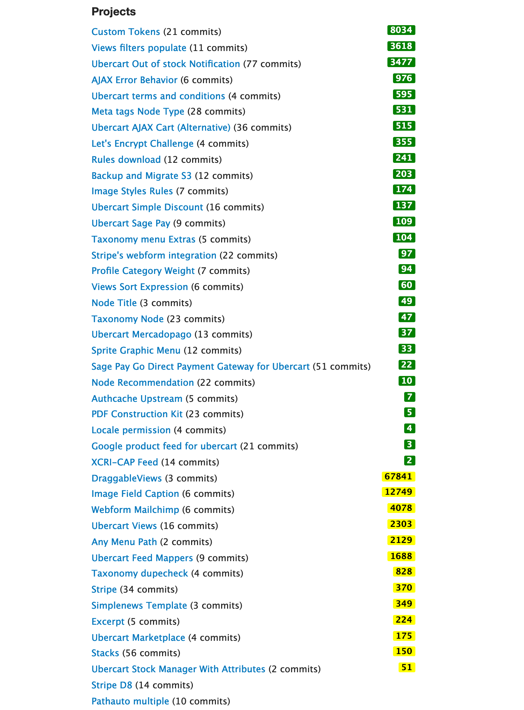

# contributor.drupal.user.js

I normally like to see how the modules I contributed are being used as well as quickly identify those I created and those I am listed as a maintainer.

This was just a playground for userscripts.

I tested this with https://github.com/Tampermonkey/tampermonkey on Chrome.

If you have tampermonkey installed, it should be able to take care of installing it by <a href="https://github.com/hanoii/contributor.drupal.user.js/raw/master/contributor.drupal.user.js">clicking here</a>.

- Green are the ones you created.
- Yellow are the ones you are listed as a maintainer.

It also sorts your project list by usage, putting your owns first and the ones you mantain after.

It is supposed to work only on your profile page when logged in and it has some localStorage cache not to query the projects every time, but rather weekly. 

